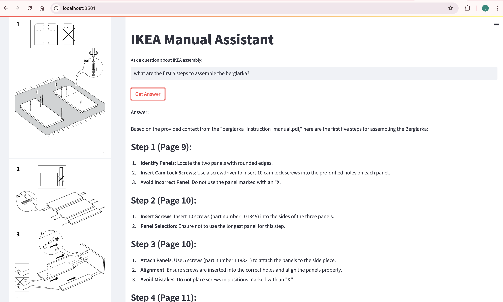

# IKEA Manual Assistant: Multimodal RAG with LlamaIndex

## Introduction

IKEA manuals are known for their unique, wordless approach to assembly instructions, relying heavily on illustrations to guide users through the furniture assembly process. While this visual approach transcends language barriers, it can sometimes be challenging for users to interpret the diagrams correctly.

This project demonstrates how to build a multimodal RAG (Retrieval-Augmented Generation) system using LlamaIndex that can:
1. Parse and understand IKEA manual images
2. Convert visual instructions into clear, textual explanations
3. Answer user queries by combining visual and textual understanding

The code is based on the [LlamaIndex RAG Article](https://levelup.gitconnected.com/exploring-multimodal-rag-with-llamaindex-and-gpt-4-or-the-new-anthropic-sonnet-model-96705c877dbb).


*Example of a typical IKEA manual page showing wordless, visual instructions*

## Technical Overview

The application uses several key technologies:
- **LlamaIndex**: For document processing and RAG implementation
- **OpenAI GPT-4o-mini**: For multimodal understanding
- **Streamlit**: For the web interface
- **LlamaParse**: For PDF parsing with multimodal capabilities

## Setup Instructions

### 1. Environment Setup

Create and activate a new conda environment:
```bash
conda create -n ikea-assistant python=3.9
conda activate ikea-assistant
```

Install requirements:
```bash
pip install -r requirements.txt
```


### 2. API Keys Configuration

Create a `.env` file in the root directory:
```bash
OPENAI_API_KEY=<your-openai-api-key>
LLAMA_CLOUD_API_KEY=<your_llama_cloud_api_key>
```


### 3. Data Preparation

1. Do a git clone of the repo:
```bash
git clone https://github.com/llamacloud/ikea-manual-assistant.git
```

#### Project Structure

```
.
├── README.md                  # Project documentation and setup guide
├── data_images               # Directory containing extracted images from PDFs
│   ├── *-page_*.jpg         # Extracted manual pages as JPG files
├── manuals                 # Directory for source PDFs
│   ├── files                # Contains original IKEA manual PDFs
│   │   ├── *.pdf           # IKEA instruction manual PDFs
├── parsed_data              # Storage for processed manual data
│   ├── image_dicts.json    # JSON file containing image metadata and analysis
│   └── md_json_objs.json   # JSON file containing extracted text in markdown format
├── requirements.txt         # Python package dependencies
├── images                 # Directory for images
├── storage_manuals         # LlamaIndex vector store and index files
│   ├── default__vector_store.json   # Vector embeddings for text content
│   ├── docstore.json               # Document storage for nodes
│   ├── graph_store.json            # Graph structure of the index
│   ├── image__vector_store.json    # Vector embeddings for image content
│   └── index_store.json            # Index metadata and configuration
├── .env                    # Environment variables (API keys)
└── ikea_app.py            # Main application file with Streamlit interface
```

### Key Components:

**Source Files**
   - `ikea_app.py`: Main application containing the Streamlit interface and RAG implementation
   - `.env`: Configuration file for API keys (OpenAI, LlamaCloud)
   - `requirements.txt`: Lists all Python dependencies

**Generated Directories**
   - `data_images/`: Contains extracted images from the PDF manuals
   - `parsed_data/`: Stores processed JSON data from the manuals
   - `storage_manuals/`: Contains LlamaIndex vector stores and indices

**Input Data**
   - `manuals/files/`: Directory for storing original IKEA manual PDFs
   - Supports multiple PDF manuals simultaneously

**Generated Files**
   - `*__vector_store.json`: Vector embeddings for text and image content
   - `docstore.json`: Document storage containing processed nodes
   - `image_dicts.json`: Processed image data and analysis
   - `md_json_objs.json`: Extracted text content in markdown format

### Important Notes on Generated Directories

The following directories are automatically generated when running `ikea_app.py` for the first time:
- `data_images/`
- `parsed_data/`
- `storage_manuals/`

These directories serve as a cache to speed up subsequent queries on the same files. The application will:
1. Check if these directories exist before processing
2. Use cached data if available
3. Only regenerate if the directories are missing

**When to Delete Generated Directories:**
You must delete these three directories and run `ikea_app.py` again if you:
- Change the input directory path
- Add new PDF files to the existing directory
- Want to force a fresh processing of the manuals

```bash
# To reset the cache, delete the generated directories
rm -rf data_images parsed_data storage_manuals
```

2. Place your IKEA manual PDFs in the `manuals/files` directory
```bash
mkdir ./manuals/files
```

## How It Works

The application follows these steps (as implemented in `ikea_app.py`):

1. **Document Processing**:
   - Uses LlamaParse to extract both text and images from PDF manuals
   - Processes images using GPT-4o-mini for visual understanding
   - Stores parsed results in `parsed_data/` directory

2. **Vector Store Creation**:
   - Creates text nodes from parsed content
   - Generates embeddings using OpenAI's text-embedding-3-large
   - Stores indexed content for faster subsequent access

3. **Query Processing**:
   - Implements a custom MultimodalQueryEngine
   - Combines text and image understanding for comprehensive responses
   - Uses a specialized prompt template for IKEA assembly assistance


*High-level architecture of the multimodal RAG system*

## Running the Application

1. Start the Streamlit application:
```bash
streamlit run ikea_app.py
```


2. Access the web interface:
   - Open your browser to `http://localhost:8501`
   - Select a manual from the sidebar
   - Ask assembly-related questions in the input field


*Screenshot of the application interface*

## Key Features

- **Multimodal Understanding**: Combines visual and textual information for comprehensive responses
- **Context-Aware Responses**: Provides page references and relevant manual sections
- **Interactive PDF Viewer**: Built-in manual viewer for easy reference
- **Persistent Storage**: Saves processed data for faster subsequent runs

## Implementation Details

The core implementation in `ikea_app.py` showcases several LlamaIndex features:

1. **Custom Query Engine**:
   ```python
   class MultimodalQueryEngine(CustomQueryEngine):
       # Handles both text and image processing
       # See ikea_app.py for full implementation
   ```

2. **Vector Store Integration**:
   ```python
   def create_index(nodes):
       # Creates and manages vector store
       # See ikea_app.py for full implementation
   ```

## Contributing

Feel free to contribute to this project by:
1. Adding support for more manual formats
2. Improving the query processing
3. Enhancing the user interface

## Note

Remember to add the following images to your `images/` directory for better documentation:
- ikea_manual_example.png
- project_structure.png
- system_architecture.png
- app_interface.png

These images will help users better understand the project structure and workflow.